  
  
  
  

  
  
  

## About

I'm an engineer working on coding agents and multi-agent systems, with a background in NLP and LLM applications. Most of my time goes into building tools that help teams ship software faster (code analysis, review, and workflow automation), though I believe agents matter far beyond developer tooling. Any domain where the bottleneck is repetitive reasoning, coordination, or access to expertise is worth rethinking.

If you are starting a company around Agentic AI, have a hard problem in your domain, or want to explore an idea together, **[get in touch](mailto:levietthang0512@outlook.com)**. I'm open to collaboration, co-founding, and serious conversations with domain experts.

## Toolkit

<table>
  <tr>
    <td align="center" width="120">
      <a href="https://claude.ai/code">
        
         <b>Claude Code</b>
      </a>
    </td>
    <td align="center" width="120">
      <a href="https://openai.com/codex">
        
         <b>Codex</b>
      </a>
    </td>
    <td align="center" width="120">
      <a href="https://github.com/features/copilot">
        <picture>
          <source media="(prefers-color-scheme: dark)" srcset="https://registry.npmmirror.com/@lobehub/icons-static-png/latest/files/dark/githubcopilot.png" />
          <source media="(prefers-color-scheme: light)" srcset="https://registry.npmmirror.com/@lobehub/icons-static-png/latest/files/light/githubcopilot.png" />
          
        </picture>
         <b>Copilot</b>
      </a>
    </td>
    <td align="center" width="120">
      <a href="https://antigravity.google">
        
         <b>Antigravity</b>
      </a>
    </td>
    <td align="center" width="120">
      <a href="https://www.cursor.com">
        <picture>
          <source media="(prefers-color-scheme: dark)" srcset="https://registry.npmmirror.com/@lobehub/icons-static-png/latest/files/dark/cursor.png" />
          <source media="(prefers-color-scheme: light)" srcset="https://registry.npmmirror.com/@lobehub/icons-static-png/latest/files/light/cursor.png" />
          
        </picture>
         <b>Cursor</b>
      </a>
    </td>
  </tr>
</table>

---

<table>
  <tr>
    <td>
      
    </td>
    <td>
      
    </td>
  </tr>
</table>

